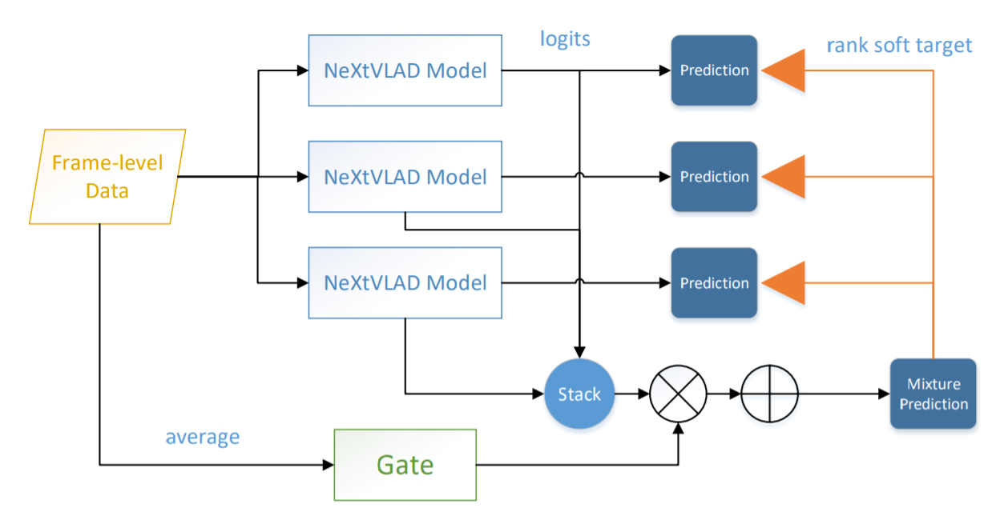
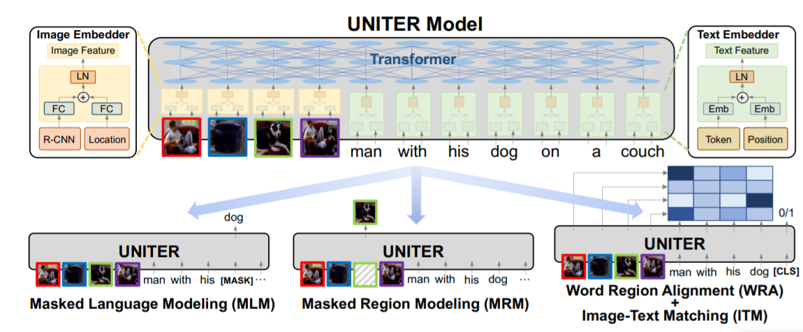

### [Multimodal Video Similarity Challenge](https://algo.browser.qq.com/)
#### [@CIKM 2021](https://www.cikm2021.org/analyticup) 
#### Implementation source codes of team <618大庆神!>.
#### Final score: 82.8307 on test_b.

#### 1. 模型总览
我们的最终结果由6个模型的ensemble组成，先在开头概述这6个模型：(test_a上的结果)
 <table>
        <tr>
            <th>Model</th>
            <th>single-model</th>
            <th>10fold</th>
            <th>weight</th>
        </tr>
        <tr>
            <th>MixNextvlad</th>
            <th>81.2</th>
            <th>81.6</th>
            <th>0.17</th>
        </tr>
        <tr>
            <th>MixNextvlad_ASL</th>
            <th>80.9</th>
            <th>81.8</th>
            <th>0.2</th>
        </tr>
        <tr>
            <th>MixNextvlad_roformer</th>
            <th>80.5</th>
            <th>81.3</th>
            <th>0.13</th>
        </tr>
        <tr>
            <th>Uniter</th>
            <th>80.3</th>
            <th>81.4</th>
            <th>0.13</th>
        </tr>
        <tr>
            <th>Uniter_ASL</th>
            <th>80.6</th>
            <th>x</th>
            <th>0.2</th>
        </tr>
        <tr>
            <th>Uniter_roformer</th>
            <th>80.2</th>
            <th>x</th>
            <th>0.17</th>
        </tr>
    </table>

部分test_b的结果：

<table>
        <tr>
            <th>Model</th>
            <th>single-model</th>
            <th>10fold</th>
            <th>weight</th>
        </tr>
        <tr>
            <th>Uniter</th>
            <th>x</th>
            <th>81.4</th>
            <th>0.13</th>
        </tr>
        <tr>
            <th>Uniter_ASL</th>
            <th>80.5</th>
            <th>x</th>
            <th>0.2</th>
        </tr>
        <tr>
            <th>Uniter_roformer</th>
            <th>80.1</th>
            <th>x</th>
            <th>0.17</th>
        </tr>
    </table>

虽然MixNextvlad单模型会高一些，但是10fold之后Uniter模型应该会好一些，因为观察到MixNextvlad模型生成的结果由许多0.

#### 2. 模型介绍
主要使用了两种模型，第一种是基于baseline改进的MixNextvald，在[1]中提出；第二种是基于transformer的Uniter [2]模型。 

##### 2.1 MixNextvlad
如图，论文中也有详细介绍，不再赘述。


##### 2.2 Uniter
如图，视频的帧feature和句子的单词embedding经过concat之后送入bert-encoder，输出的features取平均得到最后的embedding。使用该模型时预训练任务增加了MLM（masked language modeling），只对文本进行mask，然后通过上下文的文本和图像特征共同进行MLM。

细解：

模型：视频帧feature+word embedding concat之后送入12层的预训练bert & roformer，得到的features取mean。

pretrain：最终的embedding经过cls层进行tag id的多标签分类；对输入word进行15%的随机mask，然后在输出端预测这些mask的单词（MLM）。

finetune：不再mask，直接用图像特征和文本作为输入，得到mean pooling之后的256维向量，pair计算sim后和标签算mse。



##### 2.3 ASL
这是阿里巴巴最新提出的一种用于多标签分类的Loss [3]，可以有效解决多标签分类长尾样本的噪声问题。用它来替换baseline中的多标签分类的BCE损失，可以使得收敛更快，最终F1 score也更高。

##### 2.4 Roformer
用来替换bert。[4]

#### 3. 一些tricks
总体来说：先进性pretrain（多标签分类 or MLM），再进行finetune （MSE）.

NextVLAD里面的bn层不能注释掉（baseline中注释掉了）

##### 针对预训练
1. 替换原来的bert model，baseline中的是bert-uncased-chinese，更换成更好的chinese-roberta-wwm-ext；或者更换为roformer_chinese_base。
2. 对于MixNextvlad 模型，在文本特征和图像特征进行fusion前增加一个对比损失函数（contrastive loss），我们认为这样能平衡二者的量纲，能促进fusion的效果，在pretrain时能有效提升spearman 3个百分点。

##### 针对finetune
1. 使用11-fold-cross-validation：将pairwise的数据分成11份，每次用一份进行验证，这样同一个模型可以训11个模型，最终embedding取平均。
2. finetune时使用三个损失函数，包括：mse loss （直接优化similarity）、KL loss （优化模型得到的sim和label sim的分布差距）、tag loss （也就是预训练的多标签分类loss）。单独使用mse会过拟合，增加后两个之后可以有效缓解。
3. 训练轮次不宜过多，我们128的batch size只需要训练 3000或4000 steps。

#### 4. 如何复现？
所有实验在一块3090上完成。（mixnextvlad模型在1080ti也可以跑，batch调小一些）
环境： 

python==3.8.0

tensorflow==2.5.0    

transformers    

##### 4.1 数据准备
1. 下载data并解压至 Video_sim 文件夹中 （包括test_b）
2. 生成pair对的tfrecord，且有11个文件（11-fold-cross-validation）
```bash
  python write_tfrecord.py
```
生成的结果：（每个路径下面包含 train.tfrecord & val.tfrecord）
```
├── data/
|   ├── pairwise/           
|   |   ├── 0-5999val/
|   |   ├── 6000-11999val/
|   |   ├── 12000-17999val/
|   |   ├── 18000-23999val/
|   |   ├── 24000-29999val/
|   |   ├── 30000-35999val/
|   |   ├── 36000-41999val/
|   |   ├── 42000-47999val/
|   |   ├── 48000-53999val/
|   |   ├── 54000-59999val/
|   |   ├── 60000-65999val/
```

##### 4.2 直接测试（通过现有的ckpt得到最终的结果）
先下载final_save，mv至Video_sim文件夹中，然后直接运行run.sh文件.
该sh会运行所有模型的inference，包括6个模型的11-fold，然后对所有embedding进行一个加权的ensemble。
最后输出为 result_10_b.zip

```bash
sh run.sh
```

PS：如果只想测试一个模型的话，以MixNextvlad为例，那只需要下载一个 final_save/10fold_1_mix, 然后运行：

```bash
python inference_pair_b.py --ckpt-file final_save/10fold_1_mix/ckpt-4014 --output-zip 10fold_b_zip/10fold_1_mix.zip
```

##### 4.3 模型预训练
+ Pre-Train on MixNextvlad models:
    + MixNextvlad:
    ```bash
    python cqrtrain_mix.py --batch-size 256 --savedmodel-path save/mix
    ```
    + MixNextvlad_ASL:
    ```bash
    python cqrtrain_mix_asl.py --batch-size 256 --savedmodel-path save/mix_asl
    ```
    + MixNextvlad_roformer:
    ```bash
    python cqrtrain_mix_roformer.py --batch-size 256 --savedmodel-path save/mix_roformer --bert-dir junnyu/roformer_chinese_base
    ```
+ Pre-Train on Uniter models:
    + Uniter:
    ```bash
    python cqrtrain_mlm_mm_tag.py --batch-size 256 --savedmodel-path save/uniter --uniter-pooling mean 
    ```
    + Uniter_ASL:
    ```bash
    python cqrtrain_mlm_mm_tag_asl.py --batch-size 256 --savedmodel-path save/uniter_asl --uniter-pooling mean 
    ```
    + Uniter_roformer:
    ```bash
    python cqrtrain_mlm_mm_tag_roformer.py --batch-size 210 --savedmodel-path save/uniter_roformer --uniter-pooling mean --bert-dir junnyu/roformer_chinese_base 
    ```
    
##### 4.4 模型finetune
注意！在训练ASL的时候有可能会出现NAN，这种情况需要重跑一次相应的模型.
建议每次只跑sh文件里面的一个模型，把其他的注释掉，这样方便debug。
```bash
sh finetune_all.sh
```

如何训练单模型？

详见finetune_all.sh，里面有6个模型的单模型训练命令。

例子：

```bash
python train_pair_mix.py --batch-size 128  --savedmodel-path save/10fold/10fold_1_mix --pretrain_model_dir save/mix --kl-weight 0.5 --total-steps 4000 --train-record-pattern data/pairwise/0-5999val/train.tfrecord --val-record-pattern data/pairwise/0-5999val/val.tfrecord
```

参数解释：pretrain_model_dir：load的预训练模型的路径 （mix/mix_asl/mix_roformer/uniter/uniter_asl/uniter_roformer）

##### 4.5 模型inference
建议每次只跑sh文件里面的一个模型，把其他的注释掉，这样方便debug。

```bash
sh infer_all.sh
```

如何测试单模型？

例子：
```bash
python inference_pair_b.py --ckpt-file save/10fold/10fold_1_mix/ckpt-4012 --output-zip 10fold_b_zip/10fold_1_mix.zip 
```


##### 4.6 ensemble
6个10fold的模型得到的embedding进行加权求和。
```bash
python ensemble_final.py
```

#### 5. References
[1] Lin R, Xiao J, Fan J. Nextvlad: An efficient neural network to aggregate frame-level features for large-scale video classification[C]//Proceedings of the European Conference on Computer Vision (ECCV) Workshops. 2018: 0-0.

[2] Chen Y C, Li L, Yu L, et al. Uniter: Universal image-text representation learning[C]//European conference on computer vision. Springer, Cham, 2020: 104-120.

[3] Ridnik T, Ben-Baruch E, Zamir N, et al. Asymmetric Loss for Multi-Label Classification[C]//Proceedings of the IEEE/CVF International Conference on Computer Vision. 2021: 82-91.

[4] Su J, Lu Y, Pan S, et al. Roformer: Enhanced transformer with rotary position embedding[J]. arXiv preprint arXiv:2104.09864, 2021.
